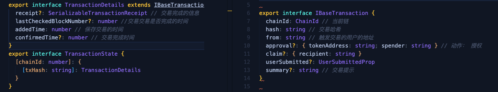

### 前置知识
> 在ethers 中，执行写入合约的时候，会返回一个promise:Promise< [TransactionResponse](https://docs.ethers.org/v5/api/providers/types/#providers-TransactionResponse) >
> TransactionResponse 类型中有一个wait 方法，当wait 执行完成的时候，(说明交易完成，交易数据写入了区块中 不懂这段话对不对) 
>
>  
>
> 在ethers中可以通过[getTransactionReceipt](https://docs.ethers.org/v5/api/providers/provider/#Provider-getTransactionReceipt)方法，根据交易hash去查询交易的结果
>
> 这个方法的特点：即时性，调用了就去查。需要去监听区块号，才能获取正确的数据

在状态中去保存交易记录时很简单的。
前提是需要对每一笔交易进行管理，从 TransactionResponse中获取到hash就可以了。

最主要的是如何保存这样的数据：

总结： **需要去依赖最新区块号 来 获取交易的信息**